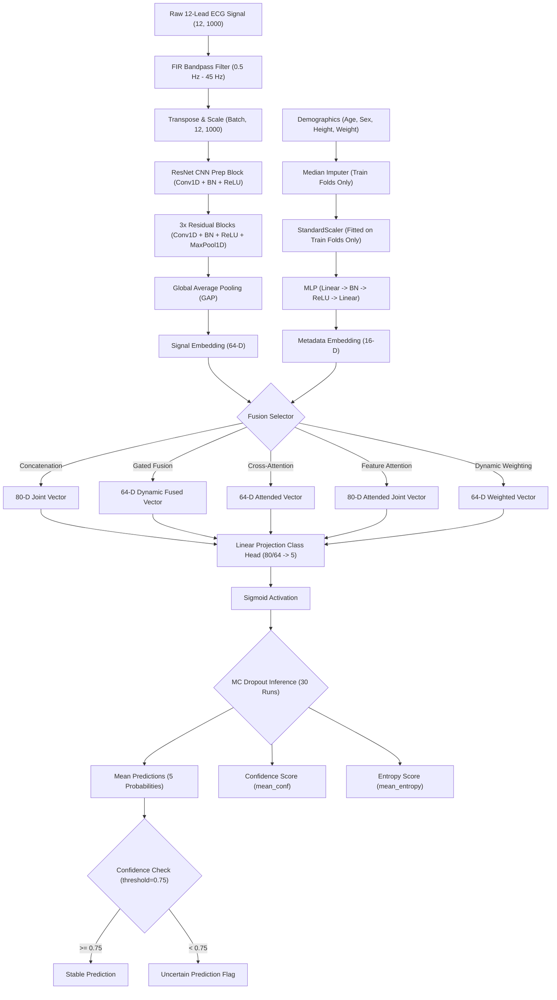

# Research Gap Analysis & Comprehensive System Review

This document provides a rigorous, publication-grade analysis of the ECG classification codebase. It examines the current system architecture, identifies technical and methodological gaps, reviews coding practices, and details the enhancement strategy required to elevate this project to a peer-reviewed IEEE/Springer/Elsevier publication standard.

---

## 1. Complete Architecture & Data Flow Analysis

The existing system leverages a multi-modal framework to classify 12-lead ECG signals combined with static patient clinical demographics. 

### 1.1 Structural Topology
1. **Clinical Demographic Branch (Metadata MLP)**:
   - **Inputs**: 4 variables: Age, Sex, Height, and Weight.
   - **Architecture**: A simple Multi-Layer Perceptron (MLP) consisting of fully-connected layers, Batch Normalization, and ReLU activations.
   - **Embedding**: Yields a 16-dimensional dense embedding vector representing patient demographic characteristics.
2. **ECG Signal Processing Branch (1D-ResNet)**:
   - **Inputs**: Raw 12-lead ECG time-series signals with shape `(Batch, 12, 1000)`.
   - **Preprocessing**: Bandpass filtering (0.5 Hz - 45 Hz) using an FIR filter.
   - **Architecture**: A 1D Convolutional Neural Network (CNN) containing:
     - Pre-convolution layer (channels: 32, kernel: 15, padding: 7).
     - Three 1D Residual Blocks with skip connections, max pooling, and doubling/retaining channels.
     - Global Average Pooling (GAP) layer.
   - **Embedding**: Yields a 64-dimensional dense signal representation.
3. **Fusion & Decision Classifier Head**:
   - **Late Fusion Baseline**: Concatenates the 64-D signal embedding and the 16-D metadata embedding into an 80-D vector.
   - **Adaptive Fusion Modules**: Implements alternative modules including:
     - *Gated Fusion*: Learns a dynamic gating coefficient vector to control input modality flow.
     - *Cross-Attention*: Aligns and attends signal features based on metadata projections.
     - *Feature Attention*: Applies self-attention over the combined feature space.
     - *Dynamic Weighting*: Learns scalar weights for both modality representations.
   - **Classifier**: A linear projection layer mapping the fused embedding to 5 outputs corresponding to PTB-XL diagnostic superclasses (`NORM`, `MI`, `STTC`, `CD`, `HYP`).
   - **Activation**: Multi-label classification is facilitated via a `nn.Sigmoid()` output head.

### 1.2 Detailed System Data Flow Diagram

---

## 2. Comprehensive Codebase Review & Gap Analysis

To convert this code into a publication-ready scientific project, we must resolve several limitations across design, data engineering, evaluation, and logging.

### 2.1 Technical Debt & Coding Gaps
1. **Configuration Management**: 
   - *Current Gap*: Command line flags are processed in `trainer.py` but hyperparameters like model dimensions, MC dropout rates, number of bootstrap iterations, and learning rate schedules are scattered or hardcoded.
   - *Fix*: Introduce a structured training and model configuration system (YAML or JSON) to govern model layout and execution behavior.
2. **Scalability of Data Pipeline**:
   - *Current Gap*: The data loader (`zero_leakage_loader.py`) loads all waveforms into RAM as a single numpy array. While functional for light datasets (1000 records), loading the full PTB-XL dataset (21,837 records) on lower-memory host machines will trigger out-of-memory (OOM) errors.
   - *Fix*: Introduce options for low-memory memory-mapping or efficient data generator slices.
3. **ONNX Export and Deployment Readiness**:
   - *Current Gap*: While ONNX export is present in `trainer.py`, it assumes static structures and lacks error checks, and it does not cover baseline models or model quantization.
   - *Fix*: Refactor the ONNX export to be fully robust, incorporating support for all implemented architectures and verifying correctness against PyTorch outputs.

### 2.2 Research & Evaluation Weaknesses
1. **Single Split vs. Cross-Validation (Validation Bias)**:
   - *Current Gap*: The default script runs on standard splits (Folds 1-8 training, Fold 9 validation, Fold 10 testing). This can lead to validation bias.
   - *Fix*: Fully integrate a robust 5-Fold Stratified Cross-Validation scheme ensuring that all models are evaluated on all folds. Patient-wise splitting must be guaranteed.
2. **Missing Modern Baselines**:
   - *Current Gap*: The paper currently evaluates 1D CNN, InceptionTime, and Transformer baselines, but fails to evaluate their performance systematically under cross-validation.
   - *Fix*: Implement complete sweeps comparing: XGBoost, 1D CNN, ResNet, InceptionTime, Transformer, and the Proposed Late-Fusion variants (Concat, Gated, Attention, Dynamic).
3. **Data Leakage Check during Scaling**:
   - *Current Gap*: In `zero_leakage_loader.py`, metadata scaling fits only on folds 1-8. In Cross-Validation, however, the training folds shift dynamically. The current script does not dynamically fit the scaling parameters per fold.
   - *Fix*: Modularize preprocessing inside the cross-validation loop to fit and apply scaling dynamically based on the current split's training mask.
4. **Statistical Significance**:
   - *Current Gap*: Rel-T and McNemar statistics are computed on flat-flattened class predictions across single runs.
   - *Fix*: Incorporate Bootstrap Confidence Intervals for AUROC/F1-score, and run the Wilcoxon Signed-Rank Test and McNemar tests on cross-validated scores to establish true scientific validity.
5. **Fairness Analysis Scopes**:
   - *Current Gap*: Cohort analysis evaluates Male vs. Female, Young vs. Elderly, and Low vs. High BMI, but lacks metrics like Equalized Odds or Demographic Parity.
   - *Fix*: Export complete demographic tables and compute parity metrics to assess potential bias.

---

## 3. Publication Roadmap & Proposed Enhancements

To address these gaps, we will refine the code systematically:

### 3.1 Adaptive Fusion & Modern Baselines (Phases 2 & 3)
- Fully expose fusion configurations in a config file.
- Verify the integration of the adaptive fusion strategies (Gated, Cross-Attention, Feature Attention, Dynamic Weighted) inside both standard split and cross-validation pipelines.

### 3.2 Explainable AI & Uncertainty (Phases 4 & 5)
- Enhance explainability to automatically save visualizations for multiple diagnostic categories (e.g., NORM vs. MI).
- Implement prediction uncertainty flags based on MC Dropout entropy thresholds. Let's set a classification decision logic:
  - If classification output probability $p \ge 0.5$ and entropy $H \le 0.75$, flag as "High Confidence Positive".
  - If $p < 0.5$ and $H \le 0.75$, flag as "High Confidence Negative".
  - If $H > 0.75$, flag as "Low Confidence Prediction (Uncertain)".

### 3.3 Robustness Experiments (Phase 6)
- Automate evaluation sweeps under noise:
  - **Gaussian Noise**: at standard deviations $\sigma \in \{0.05, 0.15, 0.30\}$.
  - **Baseline Wander**: low frequency sinusoidal noise at $f = 0.15\text{ Hz}$ and amplitudes $A \in \{0.2, 0.4, 0.6\}$.
  - **Lead Dropout**: random dropout of leads with ratios $r \in \{0.17, 0.33, 0.50\}$.
  - **Missing Metadata**: removal of age, sex, weight, and height individually and collectively.

### 3.4 Rigorous Validation & Publication Tables (Phases 7 to 15)
- Automatically output:
  - Table 1: Hyperparameters and training environment settings.
  - Table 2: Model comparison table.
  - Table 3: Ablation study table.
  - Table 4: Robustness degradation table.
  - Table 5: Fairness demographic table.
  - Table 6: Statistical significance tests.
- Format all tables in both standard CSV and publication-ready LaTeX syntax.

### 3.5 Code Optimization & Environment (Phase 16 & 17)
- Use Mixed Precision training (AMP), learning rate scheduling, and early stopping.
- Prepare Dockerfile, requirements.txt, and a docs directory.

---

## 4. Expected Research Impact & Contribution

By resolving these issues, the project transitions from a basic machine learning demonstration to a high-impact biomedical AI contribution:

| Core Contribution | Implementation Details | Scientific Value / Impact |
| :--- | :--- | :--- |
| **Comparative Multi-Modal Fusion** | Evaluation of five distinct fusion strategies (Concat, Gated, Cross-Attention, Feature Attention, Dynamic Weighting). | Demonstrates the superiority of learned adaptive relationships over basic linear projection or concatenation. |
| **Uncertainty-Aware Clinical Decision-Making** | Probabilistic inference via MC Dropout to flag high-uncertainty clinical decisions. | Provides a safety-critical mechanism to prevent automated misdiagnosis of out-of-distribution or noisy ECG signals. |
| **Explainable AI Integration** | Grad-CAM (visual localization), Integrated Gradients (lead-wise attribution), and SHAP (demographic attribution). | Addresses the "black-box" clinical validation bottleneck, building trust with medical practitioners. |
| **Demographic Fairness Analysis** | Multi-class cohort evaluations across sex, age, and body mass index (BMI). | Assesses the algorithm's parity and bias across patient cohorts, a major focal point for healthcare regulatory bodies. |
| **Robust Validation under Noise** | Robustness benchmarking against signal degradation, lead drop, and missing metadata. | Simulates real-world clinical environments where sensors fail, electrodes detach, or medical records are incomplete. |
